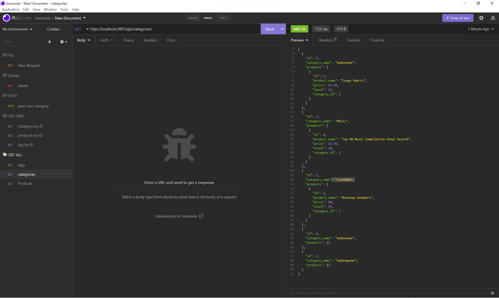

# 13 Object-Relational Mapping (ORM): E-Commerce Back End

[Link to Demo Vid](https://drive.google.com/file/d/1SzHTRaZmC-D5tsXfuDLjtYlQ9BIuR-eX/view)

## Table of Contents

- [Description](#Description)
- [Usage](#Usage)
- [License](#license)
- [Contributing](#Contributing)
- [Questions](#questions)

## Project title :

E-Commerce

## Description :

This is a bried backend structure that consists of GET, POST, PUT and Dedelete.

## Installation :

npm install to run dependencies

## Usage :

## Contributing ;

## linkedin :

## Github ;

Affiiiffff

## License :

Apache license 2.0

## Questions

If you have any questions about this projects, please contact me directly at afifpatel@hotmail.co.uk. You can view more of my projects at https://github.com/Affiiiffff.
